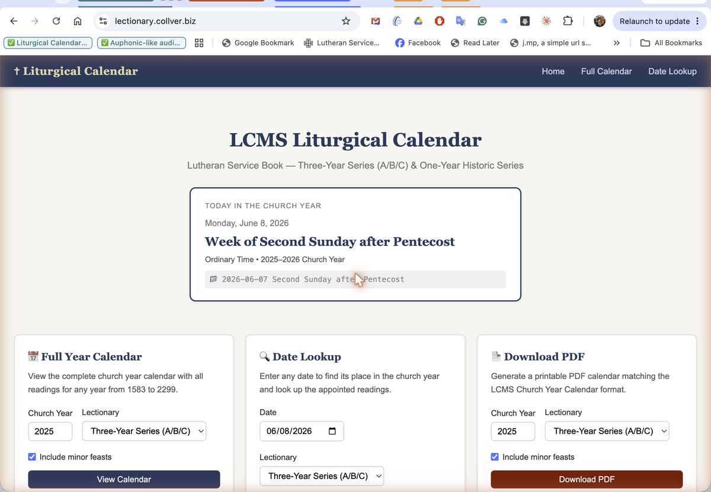

# Lutheran Lectionary — LCMS Liturgical Calendar

A Flask web app providing a complete liturgical calendar for **LCMS Lutherans** following the **Lutheran Service Book (LSB)**.

## Features

- **Timezone-aware**: "Today" is determined from the user's browser, so the correct date is shown regardless of where the server is hosted. Falls back to server UTC if JavaScript is unavailable.
- **Two lectionary series**: Three-Year (A/B/C) and One-Year Historic — with full One-Year support: Gesima Sundays (Septuagesima, Sexagesima, Quinquagesima), correct Transfiguration placement (Sunday before Septuagesima), and "N Sunday after Trinity" naming throughout the season after Pentecost
- **Remembered preference** — lectionary choice is saved in `localStorage` so every page (including the Today card) reflects your last selection; no server session or login required
- **Full-year calendar view** with liturgical color coding
- **Date lookup** — find the liturgical day for any date (1583–2299); weekdays show their governing Sunday's name ("Week of Second Sunday after Trinity") with the appointed readings
- **Minor feast detection** — weekday lookups also surface any sanctoral observance for that date (e.g. "Also today: St. Barnabas, Apostle")
- **File naming utility** — generates `yyyy-mm-dd Sunday Name` labels for sermon/recording files
- **One-Year propers** — every Sunday **and feast day** in the One-Year series displays its full introit (Latin name, Psalm reference, and antiphon text), Collect of the Day, Gradual, and appointed readings — all from the *Common Service Book of the Lutheran Church* (1917), public domain — inline in the calendar via click-to-expand, and on a dedicated printable `/propers` page. Saints' days carry their proper or common collects (Apostles'/Evangelists' commons) where the 1917 book provides them
- **iCal export** — download a `.ics` file for any church year, or subscribe via `webcal://` for a live feed that auto-updates in Apple Calendar, Google Calendar, or Outlook. Event descriptions include the appointed readings, introit and collect (One-Year), and the day's daily lectionary; add `&daily=1` (or tick the checkbox) for a transparent all-day event with the two daily readings on every day of the year, or `&civil=1` to overlay U.S. civil holidays
- **PDF export** — landscape calendar matching LCMS Church Year Calendar format, printable PDFs of the One-Year propers (`/propers/pdf`) and the daily lectionary (`/daily/pdf`), plus a one-page **"Propers for the Day" sheet** for any single date (`/day/<date>/pdf`, with a ⬇ PDF button on every lookup) — bulletin-friendly, with readings, introit, collect, gradual, Hymn of the Day, and the daily lectionary. The sheet comes in two styles: a season-colored **card** layout (default) that mirrors the website, and a minimal, toner-light **plain** print version (⬇ Plain PDF / `?style=document`). One-Year PDFs honor the Advent color preference (violet/blue)
- **About page** — the project's history (from the 1997 *Calendar Explorer* shareware to today) plus a plain-language **sources & permissions** statement, linked as **About** in the nav
- **Scripture popups** — click any reading to see ESV text via the ESV API, shown with the required "(ESV)" copyright attribution. Discontiguous references (e.g. `Matthew 10:5a, 21-33`) render every appointed verse range, and half-verse suffixes (`5a`, `9b`) are normalized to the whole verse so KJV/ASV lookups resolve too
- **Minor feasts toggle** — show principal feasts only, or include sanctoral calendar
- **Civil calendar awareness** — U.S. civil holidays and observances (Mother's Day, Memorial Day, Independence Day, Father's Day, Thanksgiving…) are shown alongside the liturgical day on the Today card and in every date lookup, so they're visible when planning. Moveable dates are derived programmatically, not hand-typed. They are clearly marked as informational only — never church propers — and can be hidden in Settings or added to the iCal feed with `&civil=1`
- **Daily lectionary** — the LSB Daily Lectionary's two readings per day (Old + New Testament) appear on the home page Today card, in every date lookup, and in the JSON API; fixed civil dates for the Christmas/Church cycles, movable Ash Wednesday→Trinity readings for the Easter cycle, exactly as appointed. A full-year chart at `/daily` can be browsed, printed, or downloaded as PDF
- **Settings page** — one place (⚙ in the nav) for all preferences: lectionary series, Advent color (contemporary blue vs. historic violet for the One-Year series), light/dark/system theme, minor feasts default, civil-calendar overlay, and scripture translation for popups and links. Everything is stored in the browser — no account, no server state
- **Hymn of the Day** — the appointed LSB hymn (number and title) for every Sunday and feast in both series, including the per-year A/B/C variations of the Three-Year plan and the distinct One-Year (de tempore) assignments; shown on the Today card, in date lookups, in the calendar's expandable propers row, and in the JSON API. Only hymn numbers and titles are listed (factual data) — hymn texts are never reproduced
- **Search** — find Sundays and feasts by name, Latin introit title, or Scripture reference ("Cantate", "Trinity", "Luke 15")
- **Permalinks** — every date has a shareable URL (`/day/2026-06-07`) with Open Graph tags for clean unfurls on social media; a "Copy permalink" button appears on lookup results
- **Dark mode** — 🌙 toggle in the header, remembered across visits
- **JSON API** — `/api/calendar/<year>` and `/api/day/<date>` for parish websites and bulletin tools (see below)
- Readings sourced from the official **LSB Propers of the Day** (CPH, 2007)

## Live Demo

You can see it running at **[lectionary.collver.biz](https://lectionary.collver.biz)**

## Screenshots



## Quick Start (Mac/Linux)

```bash
git clone https://github.com/abc3-Mac/lutheran-lectionary
cd lutheran-lectionary
pip install -r requirements.txt
python app.py
# Open http://localhost:5765
```

## Docker / Home Server

### Quick start

```bash
docker run -d --restart unless-stopped -p 5765:5765 \
  ghcr.io/abc3-mac/lutheran-lectionary:latest
```

The image is multi-arch (`linux/amd64` + `linux/arm64`) — Intel/AMD servers and
Apple Silicon or Raspberry Pi hosts each pull their native build automatically.

Then open `http://localhost:5765` (or replace `localhost` with your server's IP).

### Portainer stack

In Portainer go to **Stacks → Add stack**, paste the contents of
[`docker-compose.yml`](docker-compose.yml), and click **Deploy the stack**.

The included `docker-compose.yml` exposes port `5765` and is ready to use as-is.

### Updating

Pull the newest image and recreate the container:

```bash
docker pull ghcr.io/abc3-mac/lutheran-lectionary:latest
docker rm -f lutheran-lectionary
docker run -d --restart unless-stopped -p 5765:5765 \
  --name lutheran-lectionary \
  ghcr.io/abc3-mac/lutheran-lectionary:latest
```

With a Portainer/Compose stack, instead just **Pull and redeploy** the stack (or
`docker compose pull && docker compose up -d`).

The running version is shown in the site footer (and at `/api/version`). When a
newer GitHub release exists, the site shows an unobtrusive "Update available"
banner linking back here — it never updates anything on its own.

#### Automatic updates with Watchtower (opt-in)

If you'd rather not pull by hand, [Watchtower](https://containrrr.dev/watchtower/)
can watch the image and recreate the container when a new `:latest` is published.
**This is entirely optional — leave it out and updates stay fully manual.**

Add it alongside the app (e.g. in your Compose stack):

```yaml
  watchtower:
    image: containrrr/watchtower
    restart: unless-stopped
    volumes:
      - /var/run/docker.sock:/var/run/docker.sock
    command: --cleanup --interval 86400   # check once a day; remove old images
```

Watchtower updates **every** container on the host by default. To limit it to
just this app, label the lectionary container and run Watchtower with
`--label-enable`:

```yaml
  lutheran-lectionary:
    image: ghcr.io/abc3-mac/lutheran-lectionary:latest
    labels:
      - com.centurylinklabs.watchtower.enable=true
```

> Auto-updating means new releases roll out without review. Pin a specific tag
> (instead of `:latest`) if you prefer to vet each release before it deploys.

### Putting it behind Nginx (with HTTPS)

The container serves plain HTTP on port 5765. Nginx handles TLS termination.

**1. Get a certificate with Certbot:**

```bash
certbot certonly --nginx -d lectionary.example.com
```

**2. Nginx site config** (`/etc/nginx/sites-available/lutheran-lectionary`):

```nginx
server {
    listen 80;
    server_name lectionary.example.com;
    return 301 https://$host$request_uri;
}

server {
    listen 443 ssl;
    http2 on;
    server_name lectionary.example.com;

    ssl_certificate     /etc/letsencrypt/live/lectionary.example.com/fullchain.pem;
    ssl_certificate_key /etc/letsencrypt/live/lectionary.example.com/privkey.pem;
    ssl_protocols       TLSv1.2 TLSv1.3;
    ssl_prefer_server_ciphers on;

    location / {
        proxy_pass         http://127.0.0.1:5765;
        proxy_set_header   Host $host;
        proxy_set_header   X-Real-IP $remote_addr;
        proxy_set_header   X-Forwarded-For $proxy_add_x_forwarded_for;
        proxy_set_header   X-Forwarded-Proto $scheme;
    }
}
```

**3. Enable and reload:**

```bash
ln -s /etc/nginx/sites-available/lutheran-lectionary /etc/nginx/sites-enabled/
nginx -t && systemctl reload nginx
```

### Putting it behind Nginx Proxy Manager or Traefik

The container serves plain HTTP on port 5765 — point your proxy at
`http://<host-ip>:5765` or, if on a shared Docker network, at the container name.
Enable SSL/TLS termination at the proxy layer.

### Build from source

```bash
git clone https://github.com/abc3-Mac/lutheran-lectionary
cd lutheran-lectionary
docker build -t lutheran-lectionary .
docker run -d --restart unless-stopped -p 5765:5765 lutheran-lectionary
```

## Copyright & Licensing Policy

This project publishes **only two kinds of content**: facts, and public-domain texts. Nothing under active copyright is reproduced, and no license fees are owed by anyone running or using it.

**Facts (not copyrightable).** Scripture citations, lectionary tables, feast dates, liturgical colors, Latin introit names, and hymn numbers/titles are factual reference data. Copyright protects creative *expression*, not facts — listing "Gospel: Luke 16:19–31" or "LSB 656" infringes nothing, even though the books they point to are copyrighted publications.

**Public-domain texts.** The only liturgical *texts* reproduced are from sources whose copyrights have expired:

- Collects, introits, and graduals from the *Common Service Book of the Lutheran Church* (1917) — the same historic wording later carried into *The Lutheran Hymnal* (TLH, 1941)
- The KJV and ASV Bible translations (see below)

**What is never reproduced:** LSB/CPH collect and introit texts (referenced to the *LSB Altar Book* instead), LSB hymn texts and translations, and ESV text in any stored form.

### Bible Translations

| Translation | Status | Why it's offered |
|---|---|---|
| **ESV** — English Standard Version (default) | © Crossway; used via the official [ESV API](https://api.esv.org) | Crossway grants free API access for non-commercial use. Passages are fetched live, displayed transiently in the popup with the required "(ESV)" copyright attribution, and never stored or republished by this app — exactly the use the API license is designed for. |
| **KJV** — King James Version (1611/1769) | Public domain (US) | Predates copyright law's term limits entirely. |
| **ASV** — American Standard Version (1901) | Public domain | Published 1901; its copyright has long since expired. |

The guiding requirement is **zero license fees**. Translations requiring paid licensing (NIV, NKJV, NASB, etc.) are deliberately excluded. Public-domain texts are served by [bible-api.com](https://bible-api.com); other public-domain options there (WEB, Darby, Young's Literal) could be added on request.

**Reference handling.** Lectionary citations carry forms the Bible APIs don't fully understand. The popup (`static/main.js`) normalizes a reference before fetching: half-verse suffixes such as `5a`/`9b` are stripped to the whole verse (no API serves sub-verse precision, and `bible-api.com` 404s on them), and discontiguous ranges like `Matthew 10:5a, 21-33` — which the ESV API returns as one passage block per contiguous range — are all rendered, not just the first. Pinned by `tests/test_scripture_ref.py`.

## JSON API

Two read-only endpoints for integrating the calendar into parish websites, bulletin generators, or other tools:

```
GET /api/calendar/<year>?lectionary=three_year|one_year&minor=0|1
GET /api/day/<YYYY-MM-DD>?lectionary=three_year|one_year
```

Examples:

```bash
# Full 2025–2026 church year, one-year series
curl https://lectionary.collver.biz/api/calendar/2025?lectionary=one_year

# A single date
curl https://lectionary.collver.biz/api/day/2026-06-07?lectionary=one_year
```

`<year>` is the church year's starting (Advent) year. Responses include the day's name, season, liturgical color, readings, and — for the One-Year series — introit and collect.

## Development

```bash
pip install -r requirements.txt pytest
python -m pytest tests/    # regression suite: computus, Advent, Trinity numbering, link cleaning, routes
python app.py              # serves on http://127.0.0.1:5765 via waitress
```

Tests run automatically in CI on every push; the Docker image is only built and published if they pass.

## Lectionary Data

All readings are extracted from the **LSB Propers of the Day** (Concordia Publishing House, 2007):

- **Three-Year Series**: 77 Sunday/feast slots × 3 series (A/B/C) = 231 reading sets
- **One-Year Series**: 119 slots including Sundays after Trinity, pre-Lent Sundays, and the full sanctoral calendar

Psalm references include antiphon notations. "Or" alternatives are preserved exactly as printed in the LSB.

## Series Cycle

| Church Year | Series |
|-------------|--------|
| 2025–2026   | A      |
| 2026–2027   | B      |
| 2027–2028   | C      |

## Roadmap

- **Docker container** — home server deployment with a single `docker run` command
- **Semantic version numbers** — cut `v1.x` git tags + GitHub Releases so the footer/`/api/version` shows a real version instead of a commit SHA, and the in-app "Update available" banner has releases to compare against (build-time version injection and the banner are already wired up)
- **Roman Catholic** — Roman Rite lectionary (Ordinary Form, 3-year cycle)
- **Anglican / Episcopal** — Revised Common Lectionary as used in the Episcopal Church and Anglican Communion
- **Eastern Orthodox** — Byzantine lectionary (Epistle and Gospel pericopes)
- **Lutheran One-Year expanded** ✅ — collects, introit antiphons, and graduals (Common Service Book, 1917) for all 76 One-Year Sundays and feast days, plus sanctoral collects for the saints' days the 1917 book covers; inline in calendar and on a printable `/propers` page (with appointed readings). Advent defaults to historic violet for the One-Year series
- **Single-day Propers PDF** ✅ — one-page printable "Propers for the Day" sheet at `/day/<date>/pdf`, linked from every lookup card; available in a website-matching **card** style (default) or a minimal **plain** print style
- **Server-side ESV proxy** — move ESV fetches behind a Flask route so the API key lives in an env var instead of client-side JS, with passage caching (immutable text → cache indefinitely); hides/rotates the key, protects the shared quota, and centralizes the attribution requirement
- **iCal / webcal export** ✅ — live subscription feed for Apple Calendar, Google Calendar, Outlook
- **Civil / secular holiday awareness** ✅ — U.S. civil holidays shown alongside the liturgical day (Today card, date lookup), togglable in Settings and addable to the iCal feed with `&civil=1`; informational only, kept distinct from church propers. Other countries to follow
- **Trinity Sunday ordinal fix** ✅ — corrected off-by-one in Trinity season numbering; "First Sunday after Trinity" now correctly assigned to the Sunday immediately following Trinity Sunday
- **Mobile-responsive calendar** ✅ — portrait view shows Date + Festival/Sunday only (no truncation); rotate to landscape to see all readings (First Reading, Psalm, Epistle, Gospel); works on Safari, Chrome, and Brave on iOS
- **Bible Gateway link sanitization** ✅ — scripture links now strip liturgical annotations (antiphons, procession notes) and convert optional parenthesized verse ranges to comma-separated ranges so every reading loads correctly on Bible Gateway (~30% of links were previously broken) — thanks to [@TomaceGordon](https://github.com/TomaceGordon) for the contribution!

## Analytics (Umami)

The app has a built-in hook for [Umami](https://umami.is) analytics. No tracking code is stored in the repository — you supply it via environment variables at deploy time.

Add these to your Portainer stack or `docker-compose.yml`:

```yaml
environment:
  FLASK_ENV: production
  UMAMI_SCRIPT_URL: https://analytics.example.com/script.js
  UMAMI_WEBSITE_ID: your-website-id-here
```

If either variable is absent the script tag is simply not rendered, so the app works fine without it.

## License

MIT — free for personal, parish, and educational use.

---

Albert Bernard Collver III, Ph.D.
